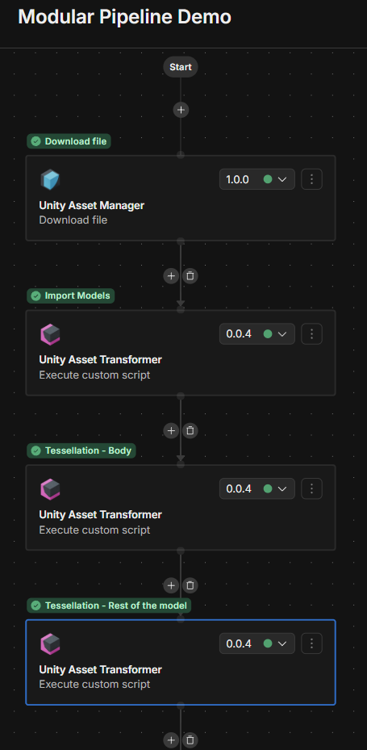
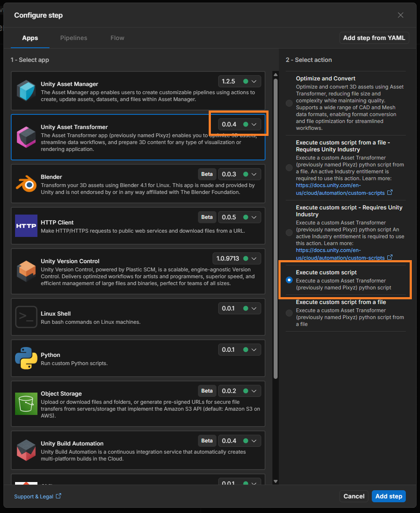
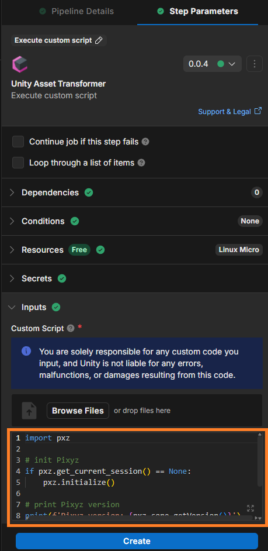
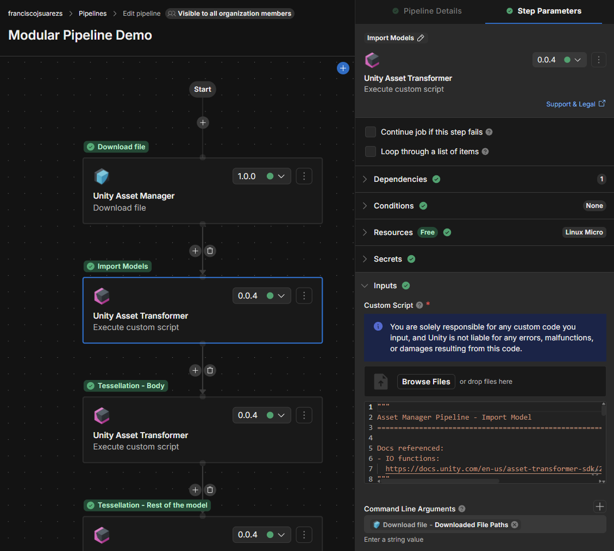
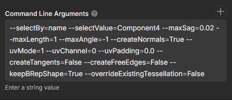
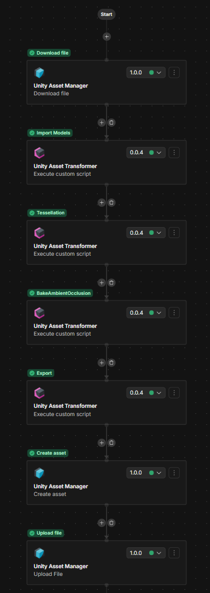
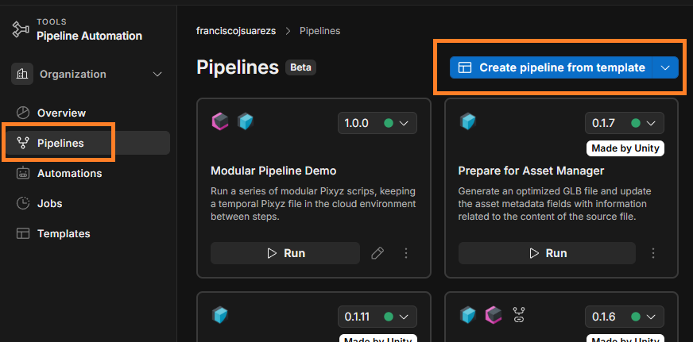
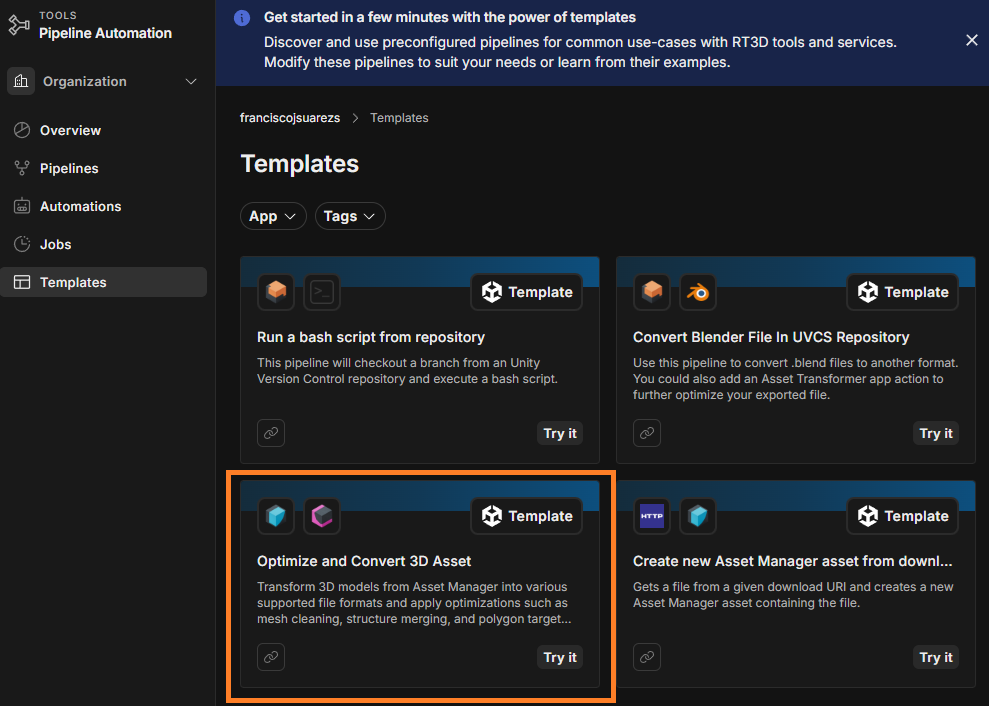
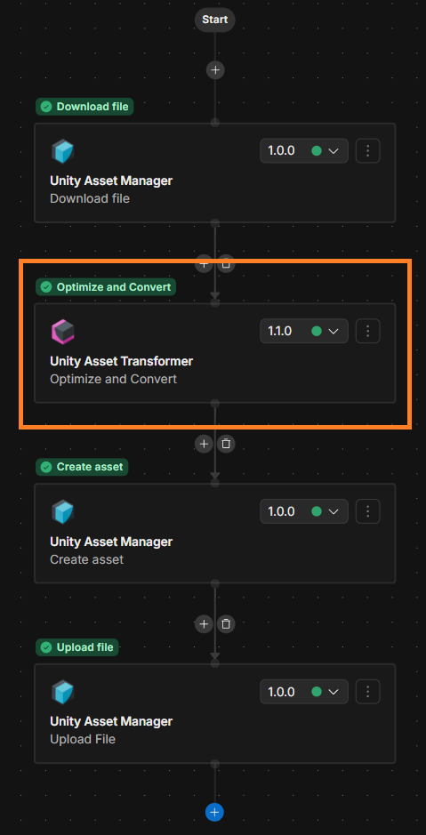

# UAM Pipeline Demo — Modular Pixyz Nodes for Unity Asset Manager

This repo is a library of small, standalone Python scripts written against
the **Pixyz SDK** (rebranded by Unity as the **Unity Asset Transformer
SDK**). Each script lives in [`Modular_Pipeline/`](Modular_Pipeline/) and is
designed to run as a single **"Run Script" node** inside a Unity Asset
Manager pipeline. Instead of writing one big monolithic import → process →
export script, you chain several small ones together in the online pipeline
creator, and each node does one job.

## Core concept: every script is a pipeline node

A Unity Asset Manager pipeline is a graph of nodes. This repo maps one
script to one node:

- [`import.py`](Modular_Pipeline/import.py) — first node, imports the
  source file.
- Any number of intermediate processing nodes (tessellate, merge parts, remove parts,
  make materials metallic, bake AO to texture or vertices, …) in between.
- [`export.py`](Modular_Pipeline/export.py) — last node, writes the final
  output file(s).

Because every node follows the same hand-off convention (below), you can
mix, match, reorder, and repeat nodes to assemble whatever pipeline a given
job needs — you're not limited to one fixed sequence.



> Node graph in the Unity Asset Manager pipeline
> creator, showing several Run Script nodes chained in sequence.


## How nodes hand off work to each other

Each pipeline run is a separate process invocation of a separate script, so
nodes can't share Python state directly. Instead they hand off through a
shared checkpoint file on disk:

```python
TEMP_PIXYZ_FILE_DIR = "/workspace/temp"
TEMP_FILE_NAME = "resume.pxz"
TEMP_FILE = os.path.join(TEMP_PIXYZ_FILE_DIR, TEMP_FILE_NAME)
```

- **Every node except `import.py`** starts by loading `/workspace/temp/resume.pxz`
  (`importTemporalPixyzScene()`) — this is the scene state left by the node
  before it.
- **Every node except `export.py`** ends by saving the scene back to the
  same path (`saveTempPixyzFile()`) — this is what the next node will pick
  up.

So the pattern for any middle node is: load `resume.pxz` → do one focused
operation → save `resume.pxz` again, overwriting it.

## Creating a node

1. Click the **+** icon to add a step.
2. Select the **Unity Asset Transformer** app, then **"Execute Custom
   Script"** from the right panel, and click **Add step**.



3. In the parameters window on the right, copy/paste one of the scripts
   from this repo and click **Create**.




## Fine-tuning a node with command-line arguments

The Run Script node's configuration panel has a **command-line arguments**
field. Whatever you type there becomes `sys.argv[1:]` for that node's
script — this is how you tune what a specific node instance does without
touching the script's code.



> Screenshot of a single Run Script node's configuration panel, with the
> script path and the command-line arguments field visible.



> Close-up of the command-line arguments field populated for the tessellation node,
> e.g. `--selectBy=name --selectValue=Wheel --maxSag=0.1`.


## Arguments node reference

| Script | Role | What it does | Example command-line arguments |
|---|---|---|---|
| [`import.py`](Modular_Pipeline/import.py) | First | Imports the source file passed by the pipeline and writes the first `resume.pxz` checkpoint. | `[ "input.step" ]` |
| [`tessellation.py`](Modular_Pipeline/tessellation.py) | Intermediate | Tessellates the whole scene, or occurrences selected by name/metadata, with configurable sag/length/angle/UV/tangent settings. | `--selectBy=name --selectValue=Wheel --maxSag=0.1` |
| [`mergeParts.py`](Modular_Pipeline/mergeParts.py) | Intermediate | Merges the named occurrences into a single part. | `--names=[PartA, PartB, PartC] --mergeHiddenPartsMode=2` |
| [`removePartsByName.py`](Modular_Pipeline/removePartsByName.py) | Intermediate | Deletes the named occurrences from the scene. | `--names=[PartA, PartB, PartC]` |
| [`makeMaterialsMetallic.py`](Modular_Pipeline/makeMaterialsMetallic.py) | Intermediate | Converts materials to PBR if needed and sets metallic/roughness (albedo untouched). | `--metallic=1.0 --roughness=0.5` |
| [`bakeAmbientOcclusionTexture.py`](Modular_Pipeline/bakeAmbientOcclusionTexture.py) | Intermediate | Bakes AO into per-part texture maps and wires them into each material's `ao` channel. **Requires UVs** — run after tessellation. | `--resolution=1024 --uvChannel=1 --samples=32 --bentNormals=True` |
| [`bakeAmbientOcclusionVertex.py`](Modular_Pipeline/bakeAmbientOcclusionVertex.py) | Intermediate | Bakes AO directly into per-vertex colors. No UVs needed. | `--samples=64 --applyFilter=False` |
| [`export.py`](Modular_Pipeline/export.py) | Last | Loads the final `resume.pxz` and writes one file per requested format. | `/output/dir myPartName [glb, fbx]` |


## Pipeline example: assembling a pipeline

A pipeline that imports a CAD part, tessellates it, bakes ambient occlusion
into textures, and exports it as glTF and FBX would be four Run Script
nodes in this order:

1. **`import.py`** — args: `[ "myPart.step" ]`
2. **`tessellation.py`** — args: `--maxSag=0.05 --createNormals=True`
   (tessellation must run *before* the AO texture bake, since that bake
   needs UV coordinates to project onto)
3. **`bakeAmbientOcclusionVertex.py`** (no arguments)
4. **`export.py`** — args: `/output/dir myPart [glb, fbx]`



> Example pipeline's node graph end-to-end

## Creating a new pipeline

A good starting point is the **"Optimize and Convert 3D Asset"** template,
since it already has the steps to get the asset in for transformation and
to upload the result back to Asset Manager once processed.

1. Go to **Pipelines** in Unity Cloud and click the dropdown, then
   **"Create pipeline from template"**.



2. Click the **"Optimize and Convert 3D Asset"** template.



3. Replace the Unity Asset Transformer node with your own custom sequence
   of modular nodes (see [Creating a node](#creating-a-node) above).



## Known quirks

- The shared `resume.pxz` checkpoint is overwritten in place — it assumes
  a linear chain, not parallel branches.
- Re-loading and re-saving the temporal Pixyz file is not the ideal
  solution, as this consumes extra time in the pipeline. It's a hacky
  workaround to maintain the scene state between nodes. Worth reaching
  out to the Cloud team to explore making this a supported workflow.
- No shared utils/helper module. The temp-file and Pixyz-init
  boilerplate is duplicated in every script. TODO: explore options to have a shared utils module in the cloud environment.
- [`InitialTests/`](InitialTests/) contains early prototypes
  (`pixyzHelloWorld.py`, `tessellationTest.py`) that predate the modular
  chain — useful as a minimal starting skeleton, but not wired into the
  `resume.pxz` hand-off convention and not meant to be used as pipeline
  nodes themselves.
